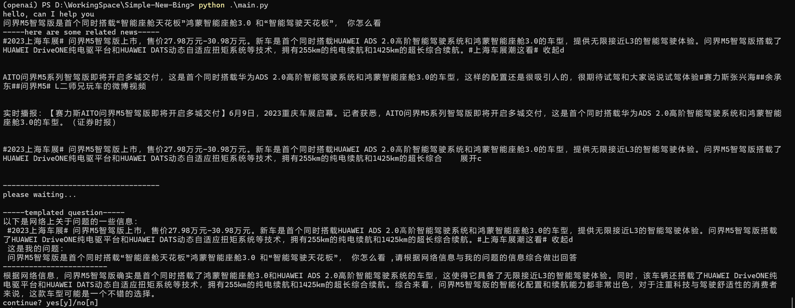
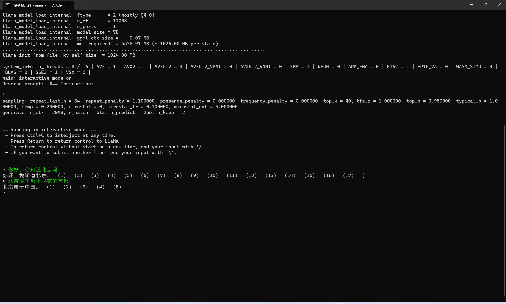
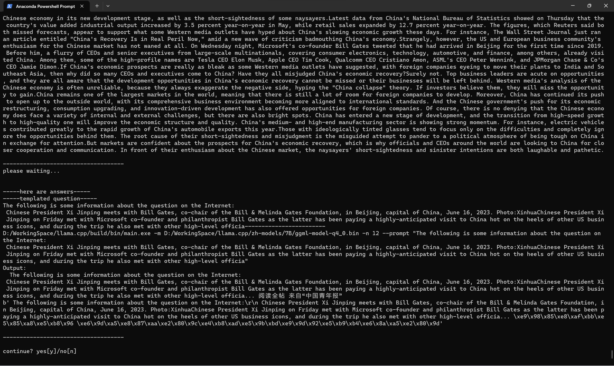
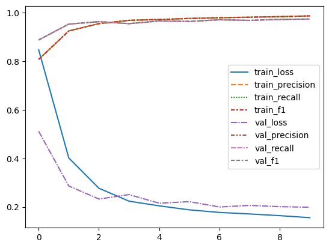

# Simple-New-Bing

## Description

Simple New Bing is a lightweight version of New Bing that emulates its functionality by aggregating news from various sources on the Internet.

Code Author:

Wang Zhilin / student ID:55211027

## Implemented Features

1. Two custom crawlers have been developed to collect news from Sina Weibo and Global Times.

2. Simple New Bing supports both English and Chinese languages.

3. The project provides an option to utilize LLaMA deployed on your PC as an alternative to ChatGPT.

4. Simple New Bing incorporates an NER (Named Entity Recognition) model to process user input, extracting relevant entities as keywords for news search. You have two choices for the NER model implementation:
   a. Utilize Spacy, an open-source NLP library that includes a NER pipeline.
   b. Alternatively, a Bert-BiLSTM model has been implemented in this repository, which can be used to address the NER task.

## Usage

### Environment

First, you need to use conda to create a new virtual environment. For example:

```
conda create -n openai python=3.11
```

Then, activate the environment and install the required packages:

```
conda activate openai

pip install -r requirements.txt
```

If you want to use the NER model in spaCy, please download the related model files. For example:

```
python -m spacy download en_core_web_sm
```

For more information, please visit [spacy.io](https://spacy.io/models).

The porject supports LLaMA. To replace Chatgpt with LLaMA, you should first deploy it locally. please visit [Chinese-LLaMA-Alpaca](https://github.com/ymcui/Chinese-LLaMA-Alpaca), [llama.cpp](https://github.com/ggerganov/llama.cpp).

### Run

#### Ask question

Before using ChatGPT, you need to configure the OpenAI API key in `config.py`.

To run the application, execute the following command

```
python main.py
```

Optional arguments:

- `-h`: Show the help message and exit.
- `-L LANGUAGE`: Choose the language. Currently supports "en" (English) and "zh" (Chinese).
- `-G GPT_MODEL`: Choose your language model. Currently supports "chatgpt" and "llama".
- `-N NER_MODEL`: Choose your NER model. Currently supports "spacy" and "bert_bilstm".
- `--show_news`: Whether to display news.
- `--show_templated_question` SHOW_TEMPLATED_QUESTION: Whether to display

#### Training Bert-Bilstm

You can run the following command to train your Bert-Bilstm model:

```
python train.py
```

Alternatively, you can run the train.ipynb notebook.

## Example

### ChatGPT




### LLaMA




### Bert-Bilstm training

| epoch | train_loss | train_precision | train_recall | train_f1 | val_loss | val_precision | val_recall |   val_f1 |
| ----: | ---------: | --------------: | -----------: | -------: | -------: | ------------: | ---------: | -------: |
|     1 |   0.848203 |        0.808142 |     0.808142 | 0.808142 | 0.511953 |      0.888224 |   0.888224 | 0.888224 |
|     2 |   0.401883 |        0.925548 |     0.925548 | 0.925548 | 0.286468 |      0.953648 |   0.953648 | 0.953648 |
|     3 |   0.277098 |        0.955566 |     0.955566 | 0.955566 | 0.232581 |      0.963761 |   0.963761 | 0.963761 |
|     4 |   0.223765 |        0.969156 |     0.969156 | 0.969156 | 0.250922 |      0.955477 |   0.955477 | 0.955477 |
|     5 |   0.204542 |        0.972554 |     0.972554 | 0.972554 | 0.215412 |      0.966477 |   0.966477 | 0.966477 |
|     6 |    0.18802 |        0.976861 |     0.976861 | 0.976861 | 0.221859 |      0.964624 |   0.964624 | 0.964624 |
|     7 |   0.177428 |        0.980063 |     0.980063 | 0.980063 | 0.199788 |      0.971418 |   0.971418 | 0.971418 |
|     8 |   0.171101 |        0.982032 |     0.982032 | 0.982032 | 0.206278 |      0.968893 |   0.968893 | 0.968893 |
|     9 |   0.164095 |        0.984379 |     0.984379 | 0.984379 | 0.201274 |      0.972973 |   0.972973 | 0.972973 |
|    10 |   0.155809 |        0.987458 |     0.987458 | 0.987458 | 0.198723 |      0.974545 |   0.974545 | 0.974545 |


