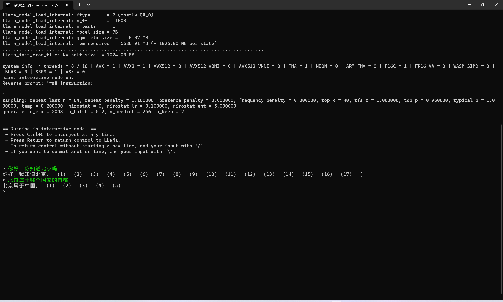

# Simple New Bing

## Description

Simple-New-Bing is a low profile version of New Bing. It imitates the New Bing to answer user's question by combing news on the Internet.

## Implemented functions

1. I complete two crawlers myself, and news sources are from Sina Webo and Global Time.
2. Simple New Bing supports language including English and Chinese.
3. The project supports to use LLaMA deployed on your PC to replace Chatgpt.
4. Simple New Bing can also handle user's input by using NER model, and then get the sequence of entities. The project use these extracted entities as keywords to search news. Regarding the NER model, you have two options: 1. you can use spacy, which is a open-source NLP library containing the NER pipline. 2. in this repository, I have completed a Bert-Bilstm model. You can use it to sovle the NER problem.

## Operation Result




## Solutions

Simple New Bing is divided to several module. Here are some introductions about them.

### News Searching

In order to answer the question based on LLM and information from the Internet, I complete two crawlers whose sources are from Sina Webo and Global Time.

#### Sina Webo

I analysis the web page structure of Sina Webo. you can send a GET request to `https://s.weibo.com/weibo?q={your question}&page={page num}`, and then will get a html containing a list of related news. Next，you extract these news from the response html. To do this, you should know that every news is wrapped by tag `<p class="txt" node-type="feed_list_content_full"></p>`, so you can use regex to extract all news.

#### Global Time

To get list of related news from Global Time, you should send a POST request to `https://search.globaltimes.cn/QuickSearchCtrl` with data `{"page_no":{page num}, "search_txt": {your search text}}`. When you get response html, you can get all hrefs of tag `<a>`, and match the href with `https://www.globaltimes.cn/page/.*`. After that， you will get all artile's href. Then you send GET request to these hrefs. The response that you get should be extracted its text wrapped by tag `<div class="article_right">`.

### NER

Named Entity Recognition (NER) is a fundamental task in natural language processing (NLP) that involves the identification and classification of named entities in text. It can be formulated as a sequence tagging problem, where the objective is to assign a relevant label to each token in a given text sequence.

$$
                    X=(x_1,x_2,...,x_n)\\
                f(X)\rightarrow(y_1，y_2,...,y_n)
$$

A simple and efficient solution to this task can be achieved by utilizing the Spacy package, which provides a straightforward implementation requiring only a few lines of Python code.

Alternatively, researchers often develop custom models, such as the Bert-BiLSTM model, to tackle the NER task. In this approach, the People's Daily 2014 dataset is commonly employed, consisting of nine distinct entity labels, including "B-PER," "I-ORG," and "I-LOC." Here, labels prefixed with "B" signify the beginning of an entity, while those prefixed with "I" indicate that the token is part of an entity.

Training such a model involves optimizing a loss function, as depicted in the figure above. The Bert-BiLSTM model leverages the power of the Bert architecture and BiLSTM layers to capture contextual information and dependencies among tokens. The loss function, denoted as loss(y, p), quantifies the dissimilarity between the true labels y and the predicted labels p. It is calculated by taking the negative logarithm of the predicted probability p for each token and summing them over the entire sequence length n. By minimizing this loss function during training, the model learns to accurately identify and classify named entities within the text.

$$
\text{loss}(\mathbf{y}, \mathbf{p}) = -\sum_{i=1}^{n} y_i \log(p_i)
$$

### OpenAI API

Before you use Chatgpt, you should first configure the OpenAI's API key in `config.py`. To imitate New Bing by combing news from the Internet, I create the following
prompt template:

```
----------------------------------------------------------------------
en:
The following is some information about the question on the Internet:\n {news} \n This is my question:\n {question}, please answer based on the information on the Internet and my question\n
----------------------------------------------------------------------
zh:
以下是网络上关于问题的一些信息：\n {news} \n 这是我的问题：\n {question} ,请根据网络信息与我的问题的信息综合做出回答\n
----------------------------------------------------------------------
```

when you ask question, your question and related news will be used to format the prompt template, and send the formated prompt to chatgpt or llama. Finally, the response from LLM will be showed on the screen.

### llama 部署

If you want to learn more about llama, please visit [Chinese-LLaMA-Alpaca](https://github.com/ymcui/Chinese-LLaMA-Alpaca), [llama.cpp](https://github.com/ggerganov/llama.cpp). Here, I briefly say some problems I meet during deploy the LLaMA.

first, [Chinese-LLaMA-Alpaca](https://github.com/ymcui/Chinese-LLaMA-Alpaca) provide the LoRA weight, and the whole weight can be obtained by merging LoRA weight and origin LLaMA weight. To run the model on CPU， I choose `Chinese-LLaMA-7B` as the model weight and merge two weights on my own computer.

second, I deploy `llama.cpp` locally. When choosing cmake to complie the project,
I meet some error. First is that mingw has two different sets of APIs named "POSIX" and "Win32" that can be used to interact with the underlying operating system. The "Win32" can not be use to complie the llama.cpp because of prohibiting std::thread.

finally, to build the llama.cpp, you should append the "-G 'mingw'" to the end of your cmake cammand.
