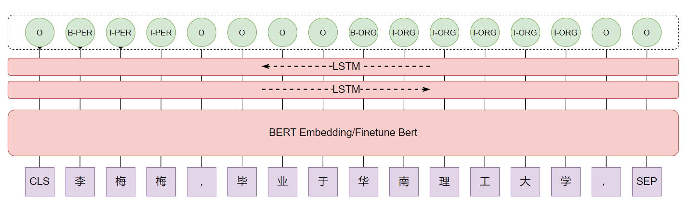
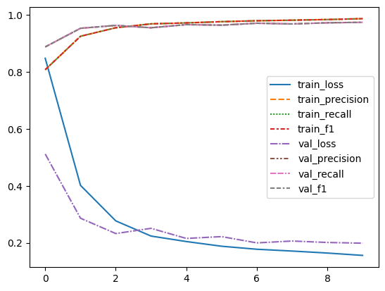

# Simple New Bing Project Report

## Description

Simple New Bing is a lightweight version of New Bing that emulates its functionality by aggregating news from various sources on the Internet.

## Implemented Features

1. Two custom crawlers have been developed to collect news from Sina Weibo and Global Times.

2. Simple New Bing supports both English and Chinese languages.

3. The project provides an option to utilize LLaMA deployed on your PC as an alternative to ChatGPT.

4. Simple New Bing incorporates an NER (Named Entity Recognition) model to process user input, extracting relevant entities as keywords for news search. You have two choices for the NER model implementation:
   a. Utilize Spacy, an open-source NLP library that includes a NER pipeline.
   b. Alternatively, a Bert-BiLSTM model has been implemented in this repository, which can be used to address the NER task.

## Operation Result

## Solutions

Simple New Bing is comprised of several modules. Here is an overview of each module:

### News Searching

To provide answers based on LLaMA and information from the Internet, I have implemented two crawlers that collect news from Sina Weibo and Global Times.

#### Sina Weibo

I analyzed the webpage structure of Sina Weibo. To retrieve a list of related news, you can send a GET request to https://s.weibo.com/weibo?q={your question}&page={page number}. The response HTML contains a list of relevant news articles. To extract the news, each article is wrapped in the <p class="txt" node-type="feed_list_content_full"></p> tag, and you can utilize regex to extract all the news articles.

#### Global Times

To obtain a list of related news from Global Times, you need to send a POST request to https://search.globaltimes.cn/QuickSearchCtrl with the data {"page_no": {page number}, "search_txt": {your search text}}. After receiving the response HTML, you can extract all the hrefs from the <a> tags and match them with the pattern https://www.globaltimes.cn/page/.\*. This will give you the hrefs of all the articles. Next, send GET requests to these hrefs, and extract the text content wrapped in the <div class="article_right"> tag from the response.

### NER

Named Entity Recognition (NER) is a fundamental task in natural language processing (NLP) that involves the identification and classification of named entities in text. It can be formulated as a sequence tagging problem, where the objective is to assign a relevant label to each token in a given text sequence.

$$
                    X=(x_1,x_2,...,x_n)\\
                f(X)\rightarrow(y_1，y_2,...,y_n)
$$

A simple and efficient solution to this task can be achieved by utilizing the Spacy package, which provides a straightforward implementation requiring only a few lines of Python code.

Alternatively, researchers often develop custom models, such as the Bert-BiLSTM model, to tackle the NER task. In this approach, the People's Daily 2014 dataset is commonly employed, consisting of nine distinct entity labels, including "B-PER," "I-ORG," and "I-LOC." Here, labels prefixed with "B" signify the beginning of an entity, while those prefixed with "I" indicate that the token is part of an entity.

Training such a model involves optimizing a loss function, as depicted in the figure above. The Bert-BiLSTM model leverages the power of the Bert architecture and BiLSTM layers to capture contextual information and dependencies among tokens. The loss function, denoted as loss(y, p), quantifies the dissimilarity between the true labels y and the predicted labels p. It is calculated by taking the negative logarithm of the predicted probability p for each token and summing them over the entire sequence length n. By minimizing this loss function during training, the model learns to accurately identify and classify named entities within the text.

$$
\text{loss}(\mathbf{y}, \mathbf{p}) = -\sum_{i=1}^{n} y_i \log(p_i)
$$

### OpenAI API

Before using ChatGPT, you need to configure the OpenAI API key in config.py. To emulate New Bing by combining news from the Internet, I have created the following prompt template:

```
----------------------------------------------------------------------
en:
The following is some information about the question on the Internet:\n {news} \n This is my question:\n {question}, please answer based on the information on the Internet and my question\n
----------------------------------------------------------------------
zh:
以下是网络上关于问题的一些信息：\n {news} \n 这是我的问题：\n {question} ,请根据网络信息与我的问题的信息综合做出回答\n
----------------------------------------------------------------------
```

When you ask a question, your question and the related news will be used to format the prompt template. The formatted prompt will then be sent to ChatGPT or LLaMA. Finally, the response from LLaMA will be displayed on the screen.

### LLaMA Deployment

If you would like to learn more about LLaMA, please visit the following repositories: Chinese-LLaMA-Alpaca and llama.cpp. Here, I will briefly describe some of the challenges I encountered during the deployment of LLaMA.

Firstly, Chinese-LLaMA-Alpaca provides the LoRA weights, and the complete model weights can be obtained by merging the LoRA weights with the original LLaMA weights. To run the model on CPU, I selected Chinese-LLaMA-7B as the model weight and merged the two weights on my own computer.

Secondly, I deployed llama.cpp locally. While using CMake to compile the project, I encountered some errors. One particular issue was related to MinGW having two different sets of APIs named "POSIX" and "Win32" that can be used to interact with the underlying operating system. The "Win32" APIs cannot be used to compile llama.cpp due to restrictions with std::thread.

Finally, to build llama.cpp, you need to append the "-G 'mingw'" flag at the end of your CMake command.

## Training log

| epoch | train_loss | train_precision | train_recall | train_f1 | val_loss | val_precision | val_recall |   val_f1 |
| ----: | ---------: | --------------: | -----------: | -------: | -------: | ------------: | ---------: | -------: |
|     1 |   0.848203 |        0.808142 |     0.808142 | 0.808142 | 0.511953 |      0.888224 |   0.888224 | 0.888224 |
|     2 |   0.401883 |        0.925548 |     0.925548 | 0.925548 | 0.286468 |      0.953648 |   0.953648 | 0.953648 |
|     3 |   0.277098 |        0.955566 |     0.955566 | 0.955566 | 0.232581 |      0.963761 |   0.963761 | 0.963761 |
|     4 |   0.223765 |        0.969156 |     0.969156 | 0.969156 | 0.250922 |      0.955477 |   0.955477 | 0.955477 |
|     5 |   0.204542 |        0.972554 |     0.972554 | 0.972554 | 0.215412 |      0.966477 |   0.966477 | 0.966477 |
|     6 |    0.18802 |        0.976861 |     0.976861 | 0.976861 | 0.221859 |      0.964624 |   0.964624 | 0.964624 |
|     7 |   0.177428 |        0.980063 |     0.980063 | 0.980063 | 0.199788 |      0.971418 |   0.971418 | 0.971418 |
|     8 |   0.171101 |        0.982032 |     0.982032 | 0.982032 | 0.206278 |      0.968893 |   0.968893 | 0.968893 |
|     9 |   0.164095 |        0.984379 |     0.984379 | 0.984379 | 0.201274 |      0.972973 |   0.972973 | 0.972973 |
|    10 |   0.155809 |        0.987458 |     0.987458 | 0.987458 | 0.198723 |      0.974545 |   0.974545 | 0.974545 |


